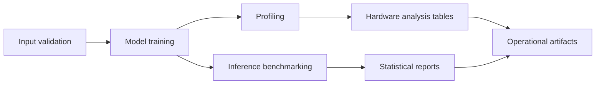

# Hardware-Aware Streaming Analytics Pipeline (NumPy Reference)

Reference implementation for experimenting with hardware-aware inference and analytics pipelines on tabular feature streams.

## What this repository does

This project provides a deterministic, CPU-first workflow for:
- ingesting and validating batch snapshots that represent streaming feature windows,
- training and evaluating compact neural inference models,
- profiling latency, memory, and precision behavior,
- generating reproducible benchmark and hardware-analysis artifacts.

## System view



## Architecture and trade-offs

- **NumPy-first runtime:** transparent data-path inspection and easy debugging, with lower peak performance than optimized kernels.
- **Single-host execution:** deterministic and easy to reproduce, but not representative of multi-node serving environments.
- **Precision simulation (`float32`/`float16`/`int8`):** useful for comparative trend analysis; not a substitute for native quantized kernel measurements.
- **Config-driven experiments:** improves repeatability and auditability, with additional setup overhead for metadata capture.

## Assumptions

- Python 3.10+ and pinned dependencies are used.
- Input schemas remain stable for each dataset version.
- Seeded execution is used for benchmark comparisons.

## Limitations

- Throughput and latency values are host-dependent.
- Energy and bandwidth outputs are estimates based on software-level counters.
- Optional framework interoperability paths depend on local availability of torch/onnx toolchains.

## Primary workflows

```bash
pip install -r requirements-dev.txt
python scripts/verify_environment.py
python scripts/run_workflow.py --mode full --experiment baseline --stats-repeats 5 --seed 42
```

See `docs/reproduce.md` and `docs/hardware_aware_study.md` for extended execution paths.
