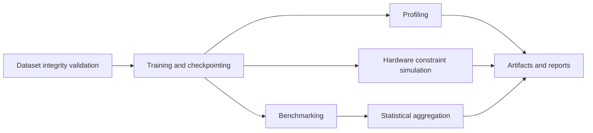

# Hardware-Aware Neural Networks from Scratch

NumPy-first reference implementation for training and evaluating a small feed-forward network under latency, memory, and precision constraints.

## Scope

The repository focuses on repeatable CPU-oriented experiments that expose system-level trade-offs:
- parameter count vs. memory footprint,
- numerical precision vs. throughput and accuracy,
- batch size vs. latency and peak memory,
- deployment format compatibility vs. runtime overhead.

The goal is to provide an inspectable baseline for architecture and systems experiments, not a production training framework.

## Repository architecture



## Project structure

- `Neural Network from Scratch/task/`: model, training, inference, profiling, simulation, and evaluation modules.
- `docs/`: reproducibility guidance, reporting templates, and hardware-analysis notes.
- `experiments/`: run logs, checkpoints, scaling outputs, and experiment metadata.
- `artifacts/`: placeholder for generated deliverables.
- `scripts/`: environment checks, dataset retrieval, and end-to-end workflow orchestration.

## CLI workflow

### 1) Environment setup
```bash
pip install -r requirements.txt
pip install -r requirements-dev.txt
python scripts/verify_environment.py
```

### 2) Dataset preparation (optional)
```bash
python scripts/download_fashion_mnist.py --out-dir "Neural Network from Scratch/task/Data"
```

### 3) End-to-end run
```bash
python scripts/run_workflow.py --mode full --experiment baseline --stats-repeats 5
```

### 4) Stage-specific runs
```bash
python scripts/run_workflow.py --mode train --experiment real_fashion_mnist
python scripts/run_workflow.py --mode benchmark --stats-repeats 7
```

## Design motivations and trade-offs

- **NumPy implementation**: easier debugging and transparent tensor movement, with lower raw performance than optimized kernels.
- **Synthetic + optional real dataset path**: deterministic smoke testing and CI compatibility, with limited representativeness for production data distributions.
- **Precision simulation (`float32`, `float16`, `int8`)**: enables comparative studies without specialized hardware, but does not replace native low-precision kernel behavior.
- **Single-process execution**: simplifies reproducibility; does not model distributed training contention.

## Assumptions

- CPU execution is the default evaluation target.
- Dataset schema matches the expected Fashion-MNIST CSV layout when real-data mode is used.
- Experiments are run with explicit seeds and fixed dependency versions.

## Limitations

- Accuracy and energy values are indicative for this architecture and software stack only.
- Reported latency includes Python overhead and is sensitive to host scheduling noise.
- ONNX export and PyTorch comparison are optional paths guarded by dependency checks.

## Failure modes and bottlenecks

- Invalid dataset shape/range fails integrity checks and blocks training by design.
- Memory pressure increases with batch size and hidden-layer width; this appears as allocation spikes during forward/backward passes.
- Profiling output is model-structure aware but does not include microarchitectural counters.

## Reproducibility references

- `docs/reproduce.md`
- `docs/reproducibility_checklist.md`
- `docs/experiment_tracking_template.md`
- `docs/hardware_aware_study.md`
