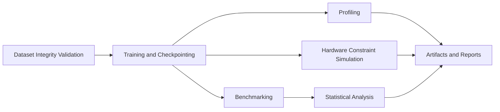

# Hardware-Aware Neural Networks from Scratch

A research engineering repository for studying deep learning performance under systems and hardware constraints using a NumPy-first implementation.

## Motivation

Edge and embedded inference systems operate under strict constraints:
- **Semiconductor efficiency limits**: precision and memory bandwidth directly impact throughput per watt.
- **Memory-latency trade-offs**: larger activation footprints reduce feasible batch size and increase wall-clock latency.
- **Deployment realism**: model quality must be evaluated jointly with latency, memory, and estimated energy.

This project is organized to make those trade-offs measurable and reproducible.

## Repository architecture



## Project structure

- `Neural Network from Scratch/task/`: model, training, inference, and hardware simulation modules.
- `docs/`: reproducibility process, experiment templates, and study notes.
- `experiments/`: run logs, checkpoints, and scaling outputs.
- `artifacts/`: generated export location for publication-ready outputs.
- `scripts/`: environment checks, dataset preparation, and workflow orchestration.

## Standardized CLI workflow

### 1) Environment setup
```bash
pip install -r requirements.txt
pip install -r requirements-dev.txt
python scripts/verify_environment.py
```

### 2) Dataset preparation (optional for real-data experiments)
```bash
python scripts/download_fashion_mnist.py --out-dir "Neural Network from Scratch/task/Data"
```

### 3) Reproducible end-to-end run
```bash
python scripts/run_workflow.py --mode full --experiment baseline --stats-repeats 5
```

### 4) Stage-specific runs
```bash
python scripts/run_workflow.py --mode train --experiment real_fashion_mnist
python scripts/run_workflow.py --mode benchmark --stats-repeats 7
```

## Reproducible experiment workflow

1. Validate environment and dependency versions.
2. Validate dataset integrity and optional SHA256 constraints.
3. Execute training with fixed seed and explicit precision mode.
4. Run benchmark and repeated statistical analysis.
5. Archive logs, checkpoints, and figures in versioned directories.

Detailed procedures are in `docs/reproduce.md` and `docs/reproducibility_checklist.md`.

## Dataset integrity validation

Dataset checks are built into the training path and include:
- existence and non-empty file checks,
- expected feature dimensionality validation,
- minimum sample-count validation,
- NaN and label-range checks,
- optional SHA256 verification for immutable datasets.

## Experiment tracking

Training runs are tracked with structured metadata and checkpoints. Use `docs/experiment_tracking_template.md` to standardize result reporting across contributors.

## Citation

If you use this repository in research, cite it as software:

```text
Author(s). Hardware-Aware Neural Networks from Scratch. GitHub repository. Year. URL.
```

## Future research roadmap

- Integrate kernel-level quantization backends for true int8 execution studies.
- Add cache-aware microbenchmarking for layerwise memory-access analysis.
- Extend deployment path to heterogeneous CPU/NPU targets.
- Incorporate power-meter-backed calibration for energy estimation.
- Add experiment registry integration for multi-node result comparison.
