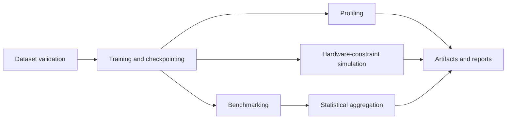

# Hardware-Aware Neural Network Systems

## Overview
This repository implements a deterministic, NumPy-first machine learning workflow for training and evaluating a compact feed-forward network under memory, latency, and numerical precision constraints. It is maintained as part of a broader AI systems engineering portfolio focused on hardware-aware machine learning, edge AI optimization, deterministic ML pipelines, and production ML systems.

## System Architecture


Core layout:
- `Neural Network from Scratch/task/`: model, training, inference, profiling, simulation, and evaluation modules.
- `scripts/`: environment validation, dataset retrieval, and workflow orchestration.
- `docs/`: reproducibility, experiment tracking, and hardware-analysis references.
- `experiments/`: checkpoints, manifests, and experiment outputs.
- `artifacts/`: generated deliverables.
- `benchmarks/`: benchmark comparison and statistical summary directories.

## Features
- Deterministic training and evaluation flow with explicit experiment controls.
- Hardware-aware analysis for memory footprint, latency, and precision behavior.
- Built-in benchmarking, profiling, and experiment tracking utilities.
- Optional interoperability checks for ONNX export and PyTorch comparison paths.
- Scripted workflow execution to support repeatable local and CI runs.

## Installation
```bash
pip install -r requirements.txt
pip install -r requirements-dev.txt
python scripts/verify_environment.py
```

## Usage
Prepare Fashion-MNIST data (optional if dataset already exists):
```bash
python scripts/download_fashion_mnist.py --out-dir "Neural Network from Scratch/task/Data"
```

Run the complete workflow:
```bash
python scripts/run_workflow.py --mode full --experiment baseline --stats-repeats 5
```

Run selected pipeline phases:
```bash
python scripts/run_workflow.py --mode train --experiment real_fashion_mnist
python scripts/run_workflow.py --mode benchmark --stats-repeats 7
```

## Reproducibility
Reproducibility guidance and templates:
- `docs/reproduce.md`
- `docs/reproducibility_checklist.md`
- `docs/experiment_tracking_template.md`
- `docs/hardware_aware_study.md`

Reproducibility assumptions:
- CPU execution is the default target.
- Input schema must match expected Fashion-MNIST CSV format when using real-data mode.
- Experiment runs should use explicit seeds and pinned dependencies.

## Related Projects
This repository is part of a larger AI systems engineering portfolio:
- `neural-network-systems`
- `digit-classification-benchmark`
- `edge-ai-model-optimization`
- `hospital-analytics-pipeline`
- `nba-data-engineering`
- `ai-systems-ml-platform`

> Repository naming note: if this repository is still named `neural-network-from-scratch`, a professional rename to `neural-network-systems` is recommended and should be performed manually in GitHub repository settings.
