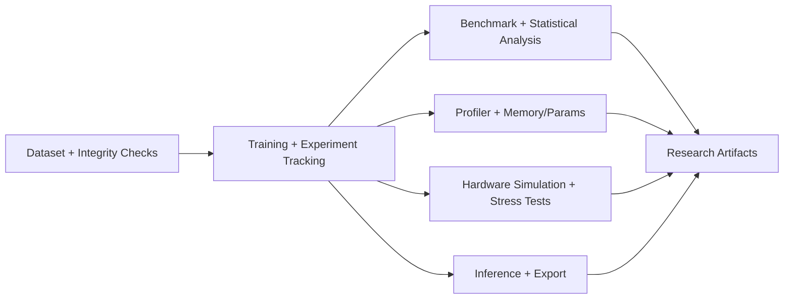
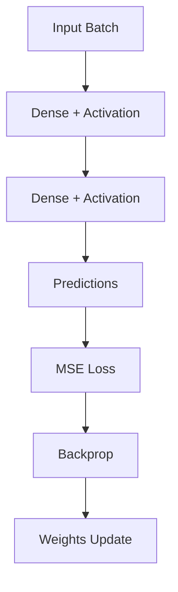

# Neural Network from Scratch — Research-Grade, Hardware-Aware ML Stack

This repository demonstrates a full **AI + hardware evaluation workflow** using a NumPy neural network core plus reproducible experiment infrastructure.

It is designed for research-style questions such as:
- How do precision modes (`float32`, `float16`, simulated `int8`) affect latency, memory, energy, and accuracy?
- How does model depth and dataset scale change compute behavior?
- How do constrained-memory scenarios alter feasible batch sizes and performance?

---

## Why this matters for edge / semiconductor AI

Modern edge AI systems are constrained by:
- on-device memory,
- throughput/latency targets,
- power and energy budgets,
- precision/quantization choices.

This codebase links ML model behavior to these system-level constraints via benchmarking, profiling, stress testing, and deployment-oriented inference tooling.

---

## System architecture (high-level)



## Training/inference model path



---

## Key components

- Core NN: `Neural Network from Scratch/task/model.py`
- Reproducibility: `task/reproducibility.py`
- Dataset integrity + hashing: `task/dataset_config.py`
- Training + experiment logging: `task/train.py`, `task/experiment_manager.py`
- Benchmarking: `task/benchmark.py`
- Statistical rigor + Pareto: `task/statistical_analysis.py`
- Profiling: `task/profiler.py`
- Hardware simulation: `task/hardware_simulation.py`, `task/hardware_stress_test.py`, `task/simulate_hardware.py`
- Framework comparison: `task/compare.py`, `task/pytorch_model.py`
- Deployment/inference: `task/deployment.py`, `task/inference.py`
- Scaling studies: `task/scaling_study.py`, `task/run_scaling_experiments.py`

---

## Reproducible environment setup

### Pip
```bash
pip install -r requirements.txt
pip install -r requirements-dev.txt
```

### Conda
```bash
conda env create -f environment.yml
conda activate nn-scratch-research
```

### Environment verification
```bash
python scripts/verify_environment.py
```

---

## Dataset pipeline (real + synthetic)

- **Default baseline** is synthetic for guaranteed end-to-end reproducibility: `--experiment baseline`.
- **Real dataset pipeline**: `--experiment real_fashion_mnist`.
- Real pipeline enforces:
  - file existence,
  - non-empty file,
  - expected feature shape,
  - minimum row count,
  - optional SHA256 validation.

Auto-prepare/download helper:
```bash
python scripts/download_fashion_mnist.py --out-dir "Neural Network from Scratch/task/Data"
```

---

## End-to-end workflow

1) Training + tracking
```bash
python "Neural Network from Scratch/task/train.py" --experiment baseline
```

2) Benchmarking
```bash
python "Neural Network from Scratch/task/benchmark.py"
```

3) Statistical benchmarking (mean/std/95% CI + Pareto)
```bash
python "Neural Network from Scratch/task/statistical_analysis.py" --repeats 5
```

4) Profiling
```bash
python "Neural Network from Scratch/task/profiler.py" --config "Neural Network from Scratch/task/config.py"
```

5) Hardware scenarios and stress
```bash
python "Neural Network from Scratch/task/simulate_hardware.py"
python "Neural Network from Scratch/task/hardware_stress_test.py"
```

6) Scaling experiments
```bash
python "Neural Network from Scratch/task/scaling_study.py" --quick
python "Neural Network from Scratch/task/run_scaling_experiments.py"
```

7) Framework comparison
```bash
python "Neural Network from Scratch/task/compare.py"
```
If torch is missing, PyTorch rows are explicitly marked `skipped`.

8) Inference / deployment checks
```bash
python "Neural Network from Scratch/task/inference.py" --weights experiments/checkpoints/<ckpt>.npz --precision float32
```
Optional ONNX export (requires torch):
```bash
python "Neural Network from Scratch/task/inference.py" --weights experiments/checkpoints/<ckpt>.npz --export-onnx
```

---

## Hardware-aware studies included

- Precision trade-offs: latency/memory/energy vs accuracy.
- Low-memory and batch-limit stress runs.
- Compute slowdown simulation.
- Energy estimation (runtime-based + FLOPs-style helpers).

---

## Limitations (explicit)

- Simulated int8 is not hardware kernel int8 acceleration.
- Energy is an estimator, not direct power-meter measurement.
- ONNX export path requires torch.
- External dataset download may be blocked by network policy; synthetic baseline remains fully reproducible.

---

## Tests

```bash
python -m unittest \
  "Neural Network from Scratch/task/test/test_vectorized_model.py" \
  "Neural Network from Scratch/task/test/test_benchmark.py" \
  "Neural Network from Scratch/task/test/test_profiler_and_scaling.py" \
  "Neural Network from Scratch/task/test/test_hardware_and_experiment_manager.py"
```
